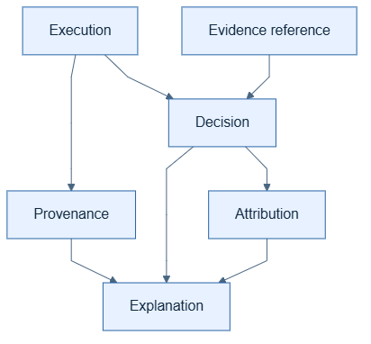

# Explainability artifacts

The following artifact categories form the intended public explainability
model. Their stable serialized forms are planned to carry schema identity and
version information.

| Artifact | Purpose |
| --- | --- |
| Execution | Identifies an observed graph run, node, or event and its ordering. |
| Provenance | Connects an artifact to its execution context and source references. |
| Evidence | References approved inputs, retrieved material, rules, or other basis. |
| Decision | Records a selection, branch, or rule application. |
| Attribution | Describes a method and its limitations for relating inputs to output. |
| Explanation | Presents an approved, policy-filtered account based on artifacts. |

Artifacts should use references instead of freely copying sensitive payloads.
An explanation must preserve uncertainty and method limitations rather than
turning a correlation or an outcome into an unsupported causal claim.
