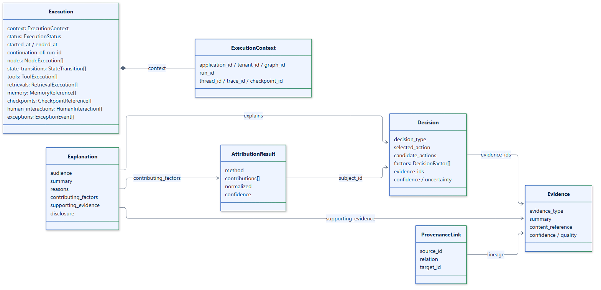

# Canonical model

Every record `langgraph-xai` produces is a canonical model: a Pydantic v2 model
whose JSON form is a stable, versioned contract. Stores persist it,
observability adapters export it, and explanation engines read it. This page
lists the models and the rules they follow. [Concepts](../concepts/index.md)
explains what they mean.

## Rules every model follows

| Rule | Mechanism | Why |
| --- | --- | --- |
| Versioned | `schema_version: "2.0.0"` on every model | Stored records stay readable and migratable as the schema evolves. |
| Strict | `extra="forbid"`, validation on assignment | Typos and unknown fields fail loudly instead of being stored silently. |
| Finite numbers | `allow_inf_nan=False` | JSON and databases cannot represent NaN or infinity faithfully. |
| Aware timestamps | `AwareDatetime`, UTC by default | Records from different hosts and timezones order correctly. |
| Identified | UUID `id` and `timestamp` on every top-level record | Records can be referenced, deduplicated, and upserted. |
| Scoped | `context: ExecutionContext` on every top-level record | Every query can be restricted to an application, tenant, and run. |
| JSON-safe extension | `metadata: dict[str, JsonValue]` | Applications can attach data without breaking serialization. |

Sets serialize as sorted lists, so the same record always serializes to the
same JSON.

## Catalog

**Context and execution**

| Model | Records |
| --- | --- |
| `ExecutionContext` | Application, tenant, graph, run, thread, trace, and checkpoint IDs, plus metadata |
| `Execution` | One run: status, timing, the run it continued from, and the lists below |
| `NodeExecution` | One node run: status, timing, attempt, parent node |
| `StateTransition` / `StateChange` | A node's state changes: path, before, after, capture mode |
| `ToolExecution` | One tool call: name, call ID, status, latency, input and output references |
| `RetrievalExecution` / `RetrievedDocument` | One retriever call and its ranked documents |
| `MemoryReference` | A long-term memory read or write, by reference |
| `CheckpointReference` | A LangGraph checkpoint linked to the run |
| `HumanInteraction` | An interrupt, resume, approval, rejection, or edit |
| `ExceptionEvent` | An error that failed or cancelled the run |

**Decision basis**

| Model | Records |
| --- | --- |
| `Evidence` / `SourceReference` | Information a decision relied on, and where it came from |
| `Decision` / `DecisionFactor` | The selected action, alternatives, factors, evidence, and policies applied |
| `ProvenanceLink` | A lineage edge from a source entity to a derived one |

**Explanation**

| Model | Records |
| --- | --- |
| `AttributionResult` / `AttributionContribution` | Signed contributions of factors and evidence to a decision |
| `PolicyDecision` | The outcome of a capture or exposure policy for one audience |
| `ExplanationContext` | The input to an explanation: execution, decision, evidence, audience, policies |
| `Explanation` / `EvidenceReference` | The audience-specific explanation and the evidence it cites |

**Events**

`CanonicalEvent` is a union of nine event types, discriminated by
`event_type`: `execution.started`, `execution.completed`, `execution.failed`,
`state.transition`, `node.execution`, `tool.execution`, `retrieval.execution`,
`checkpoint`, and `interrupt`. Each event carries its own `id`, the run's
`context`, a per-run `sequence`, and the record it announces.

**Enumerations**

`CaptureMode`, `FailureMode`, `ExecutionStatus`, `ToolStatus`, `DecisionType`,
`EvidenceType`, `Audience`, `MemoryOperation`, `HumanInteractionType`, and
`PolicyAction` are string enums. `DecisionType`, `EvidenceType`, and
`Audience` fields also accept any string, so applications can extend them
without forking the schema.

## Where each record goes

| Record | Kept on the run | Store | Observability | Plugins |
| --- | --- | --- | --- | --- |
| `Execution` (and everything in it) | Yes | Written at start, at finish, and after late records | Through its events | No |
| Events | No | Yes | Yes | No |
| `ProvenanceLink` | No | Yes | No | No |
| `Evidence`, `Decision`, `MemoryReference` | Yes | No | No | Yes |
| `AttributionResult`, `Explanation`, `PolicyDecision` | No; returned to the caller | No | No | Through `record_artifact` |

To keep explanations, attributions, or policy decisions, pass them to
`xai.record_artifact(...)`, which delivers them to plugins like any other
semantic record.

## Compatibility

Within a schema version, changes are additive only: new optional fields with
defaults and new enumeration values. Renaming or removing a field, or changing
its meaning, requires a new `schema_version`, which ships only in a new major
release. Every field is either filled by automatic capture or set through a
documented API: for example, `ToolExecution.input_reference` and
`output_reference` are set by `record_tool` for tools that run outside the
graph.

When you upgrade:

- A 1.x release reads every record written by the same or an earlier 1.x
  release.
- Models reject fields they do not know, so a record written by a newer
  release can fail validation in an older one. Upgrade the services that read
  records before, or together with, the services that write them.
- Records written by 0.1.0 (schema `"1.0.0"`) are not readable by 1.x. The
  [changelog](https://github.com/smuniharish/langgraph-xai/blob/master/CHANGELOG.md)
  lists every field that changed.
