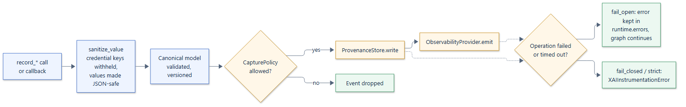
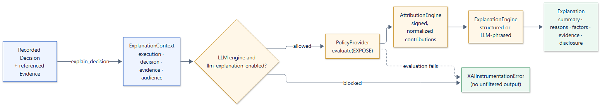

# Disclosure policy

`langgraph-xai` controls information at two boundaries: what is **recorded**,
and what is **disclosed** in an explanation. This page describes both
pipelines, and what they do and do not protect.

## Recording boundary

1. **Redaction.** Free-form values (state, metadata, interrupt payloads,
   resume answers, decision factor values, and source and document metadata)
   are converted to JSON-safe data, and credential-named keys are replaced
   with `"[not captured]"`. A factor whose name is a credential name keeps no
   value at all. This happens before the canonical record exists, so no
   provider ever sees a credential value. See
   [Redaction](../concepts/policies.md#redaction).
2. **Capture mode.** `XAIConfig.capture_state` limits which state keys are
   recorded at all: changed keys only, every key, named keys, a custom
   selection, or none.
3. **Capture policy.** The `CapturePolicy` sees each event and can drop it. A
   dropped event is not added to the run's `Execution`, not written to the
   store, and not emitted. If the policy fails, the event is dropped.
4. **Sinks.** Allowed events go to the store and the observability provider,
   bounded by the concurrency limit and timeout, with failures handled by the
   failure mode.

## Disclosure boundary

1. **LLM gate.** An LLM-backed engine runs only if
   `XAIConfig.llm_explanation_enabled` is set. This is checked before anything
   else.
2. **Exposure policy.** The `PolicyProvider` decides, for the audience, which
   sections may be shown.
3. **Rendering.** The engine fills only the allowed sections. Withheld sections
   stay empty and are announced in `disclosure`. A withheld section never
   reaches a model, and withheld factor values do not reappear in `reasons`.
4. **Fail closed.** If any step fails, `XAIInstrumentationError` is raised
   instead of returning an explanation.

## What the controls guarantee

- Values under credential-named keys are never stored or exported when they
  are recorded through instrumentation or the `record_*` methods. A record you
  build yourself and pass to `record_artifact` is delivered as you built it.
- A dropped event leaves no trace in the store, the observability backend, or
  the run's `Execution`.
- An explanation is never returned without its exposure policy having been
  evaluated.
- A withheld section's content is never sent to an LLM.
- Raw content and private memory are never read by the built-in engines;
  explanations cite evidence by ID and summary.

## What they do not do

- **Authenticate audiences.** The policy trusts the `audience` it is given.
  Your application must decide who the caller is.
- **Recognize personal data by value.** Redaction works on key names. An email
  address in a field named `contact` is recorded unless capture mode or a
  capture policy excludes it.
- **Secure the backends.** Access control, encryption at rest, and retention in
  your database and tracing tools remain your responsibility.
- **Enforce retention.** How long records are kept, and when they are
  deleted, is decided by your store and database. The runtime evaluates
  capture (`PolicyAction.CAPTURE`) and exposure (`PolicyAction.EXPOSE`)
  policies only.

See [Security](../operations/security.md) for deployment guidance.
