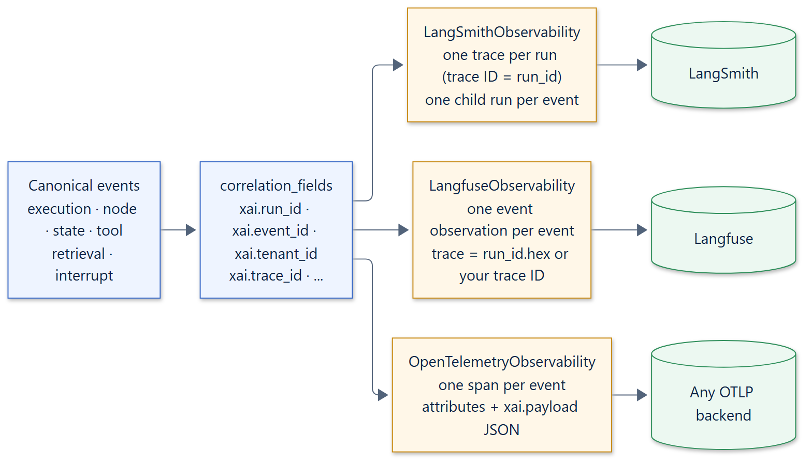

# Observability

An `ObservabilityProvider` receives every canonical event that the capture
policy allows and forwards it to a tracing backend. One provider is active per
runtime. The default, `NoOpObservability`, discards events.

## Adapter guarantees

The bundled adapters share the `ObservabilityAdapter` base class, which
provides the same guarantees for every backend:

| Guarantee | Mechanism |
| --- | --- |
| At most once per event | Events are deduplicated by their `id` over a window of the last 4,096 events (`deduplication_window`). A failed emit is forgotten, so the same event can be retried. |
| Non-blocking | Synchronous SDK calls that may do network I/O, such as flush and shutdown, run in a worker thread. Event submission uses each SDK's background batching. |
| Consistent errors | Backend failures are raised as `ObservabilityAdapterError` with the cause chained, and handled by the runtime's failure mode. |
| Clear lifecycle | `close()` is idempotent. Emitting or flushing after it raises `AdapterClosedError`. A client or provider the adapter created is closed with it; one you passed in is left open. |
| Optional dependencies | A missing SDK raises `OptionalDependencyError`, naming the extra to install. |

Emits are not serialized. Concurrent events reach the backend concurrently,
bounded by the runtime's `max_concurrency`.

## Correlation fields

Every adapter attaches the same identifiers, as span attributes or metadata,
so events can be joined across systems:

| Field | Always present |
| --- | --- |
| `xai.event_id` (the event's `id`), `xai.event_type` | Yes |
| `xai.application_id`, `xai.tenant_id`, `xai.graph_id`, `xai.run_id` | Yes |
| `xai.thread_id`, `xai.trace_id`, `xai.checkpoint_id` | When the run's context has them |

`correlation_fields(event)` and `event_payload(event)` (the event's JSON) are
public helpers for custom adapters.

## Mapping per backend

| Backend | One run becomes | One event becomes |
| --- | --- | --- |
| [LangSmith](../integrations/langsmith.md) | A trace whose ID is the run ID, with a root run that ends with the run's status | A child run named after the event type, with the event JSON as inputs |
| [Langfuse](../integrations/langfuse.md) | A trace: your 32-character hex `trace_id`, or the run ID | An event observation with the event JSON as input |
| [OpenTelemetry](../integrations/opentelemetry.md) | Spans under whatever span is current when events are recorded | A zero-duration span with correlation attributes and the event JSON in `xai.payload` |

## Writing an adapter

Subclass `ObservabilityAdapter` and implement `_emit(event)`, and optionally
`_flush()` and `_close()`. Deduplication, lifecycle checks, and error wrapping
come from the base class. To use a backend without the base class, implement
the three `async` methods of the `ObservabilityProvider` protocol directly.
