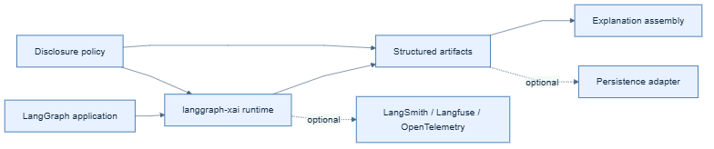

# Architecture overview

Architecture version **1.0.0** defines
`langgraph-xai` as an explainability layer around, rather than inside of,
LangGraph execution.

## Responsibilities

The runtime observes supported execution boundaries and accepts explicit
application-supplied explainability events. It produces structured artifacts,
applies disclosure policy, and can pass suitable data to optional integrations
or persistence adapters.

## Boundaries

LangGraph remains responsible for graph definition and execution. External
systems remain responsible for their own tracing, evaluation, telemetry,
storage, retention, and access control. Applications remain responsible for
the correctness of domain evidence and decisions they supply.

## Design principles

- Model the evidence and decision basis before rendering prose.
- Treat attribution as qualified metadata, not proof of causality.
- Apply disclosure controls at every data boundary.
- Make integrations optional and provider SDKs peripheral.
- Keep raw prompts, arbitrary state, and private model reasoning out of
  default explainability capture.
