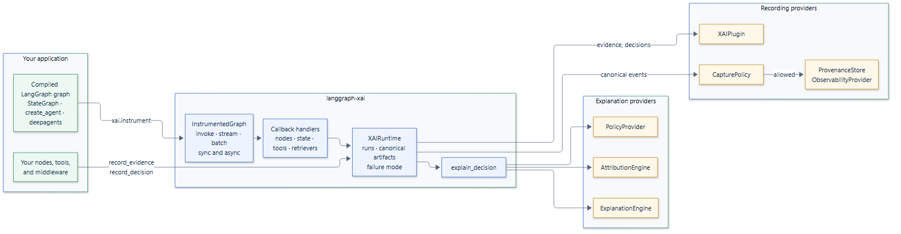

# Architecture overview

`langgraph-xai` is a library that runs inside your process. It has three
layers: instrumentation that observes a LangGraph call, a runtime that turns
observations into canonical records, and replaceable providers that store,
export, attribute, filter, and explain them.

## Components

| Component | Responsibility |
| --- | --- |
| `InstrumentedGraph` | A transparent proxy around a compiled graph. Starts and finishes a run for each top-level call, such as `invoke`, `stream`, or `astream_events`, and each batch input. Attaches the callback handler and, for a checkpointed thread, links the run to its checkpoints and to the run it continues. |
| Callback handlers | Recognize LangGraph nodes, state changes, tool calls, retrievers, and interrupts from LangChain callbacks, and record them through the runtime. |
| `XAIRuntime` | Owns configuration, the registry, and plugins. Builds canonical records, applies redaction and the capture policy, delivers records to sinks, enforces concurrency, timeouts, and the failure mode, and assembles explanations. |
| `Registry` | Maps each capability protocol to the provider one runtime uses. |
| Providers | `ProvenanceStore` (an abstract base class), plus `ObservabilityProvider`, `CapturePolicy`, `PolicyProvider`, `AttributionEngine`, and `ExplanationEngine` (each a small `typing.Protocol`), all with built-in defaults. |
| Plugins | Receive every evidence, decision, and memory record. |

## Lifecycle of a call

1. `graph.ainvoke(input, config)` reaches the `InstrumentedGraph`. If the call
   continues a checkpointed thread, the proxy reads the checkpoint it starts
   from and the run that wrote it.
2. The runtime starts a run: it builds the `ExecutionContext` from the config,
   records a `running` `Execution`, and emits `execution.started`.
3. The wrapped graph runs with the callback handler and the run ID added to its
   config. The run is bound to the current context, so nodes can call
   `record_*` methods.
4. Each recognized node, state change, tool call, retrieval, and interrupt
   becomes a record on the run's `Execution` and an event for the store and
   observability provider.
5. When the graph returns, raises, is cancelled, or pauses, the proxy records
   the last checkpoint the run wrote, and the runtime finishes the run and
   writes the final `Execution`.
6. The graph's output, or its exception, reaches the caller unchanged.

Explanations are built later, on request. See [Runtime](runtime.md) for the
details of each step.

## Design principles

- **Observe, never interfere.** Instrumentation uses LangGraph's public
  Runnable and callback APIs, does not patch LangGraph, and never changes
  inputs, outputs, or exceptions.
- **Facts, not reasoning.** Execution is captured. The basis of a decision is
  recorded explicitly by the application. Private model reasoning is never
  collected or inferred.
- **Safe by default.** Credentials are redacted before records exist,
  explanations are policy-filtered or not returned at all, and LLM phrasing
  needs two opt-ins.
- **Isolated by construction.** Every record carries application, tenant, and
  run IDs; stores scope every query by them; runtimes share no global state.
- **Replaceable everything.** Every capability has a small contract and a
  working default, so a backend can be swapped without touching the runtime.

## Package layout

| Module | Contents |
| --- | --- |
| `langgraph_xai.core` | Canonical models and capability protocols |
| `langgraph_xai.runtime` | `XAIRuntime`, `Run`, `Registry`, `XAIInstrumentationError`, `RUN_ID_METADATA_KEY` |
| `langgraph_xai.instrumentation` | `InstrumentedGraph` and its callback handlers |
| `langgraph_xai.policy` | Redaction, `DefaultCapturePolicy`, `DefaultPolicyProvider` |
| `langgraph_xai.attribution` | `HybridAttribution`, `RuleBasedAttribution`, `EvidenceAttribution` |
| `langgraph_xai.explanation` | `StructuredExplanationEngine`, `LLMExplanationEngine` |
| `langgraph_xai.storage` | The `ProvenanceStore` base class, `InMemoryProvenanceStore`, `StoreFilter` |
| `langgraph_xai.observability` | LangSmith, Langfuse, OpenTelemetry, and no-op adapters |
| `langgraph_xai.plugins` | `XAIPlugin`, `PluginManager` |

The classes you use day to day are importable from the top-level
`langgraph_xai` package. The [API reference](../api/index.md) lists every
public class and function with the module it lives in.
