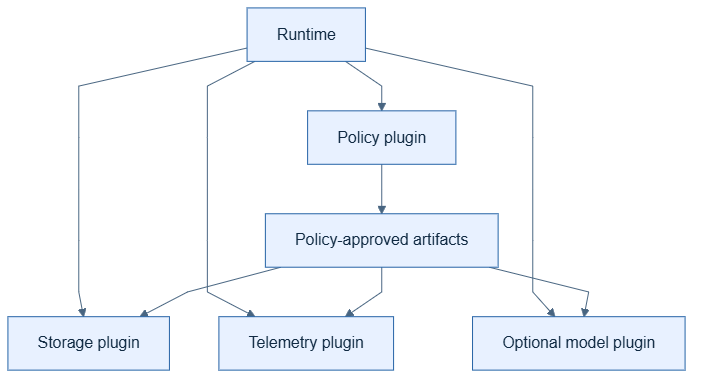

# Plugins

## Kid-level view

Plugins are replaceable helpers: a storage box, exporter, model, or policy
checker can be swapped without changing the graph.

## Production view

Adapters are injected at runtime boundaries and receive canonical,
policy-approved data plus correlation metadata. Optional provider SDKs remain
peripheral; plugin failure follows the configured failure mode and is visible.

## Why and example

Use a local store in tests and a PostgreSQL adapter in deployment while
retaining the same canonical contract.

## Common mistakes

Do not discover plugins from untrusted strings, let an adapter capture raw
state independently, or hide initialization and export errors.
