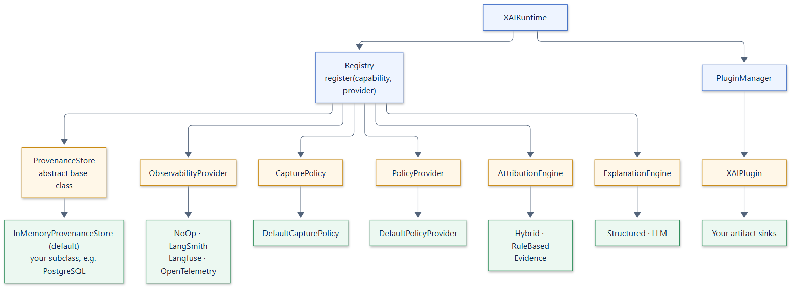

# Extensibility

Every capability of the runtime has a small, typed contract and a working
default. Storage is an abstract base class, `ProvenanceStore`: a store
subclasses it and inherits the lineage walk. Every other capability is a
`typing.Protocol` that a provider satisfies structurally, by having the right
methods, without inheriting from anything. Each runtime resolves providers
through its own `Registry`, so swapping a backend never requires changing the
runtime.



## Capabilities

| Protocol | Methods | Built-in providers |
| --- | --- | --- |
| `ProvenanceStore` | Abstract base class: `write`, `get`, `query`, `parents`, `children` to implement; `lineage` and `close` inherited | `InMemoryProvenanceStore` (default); a [PostgreSQL store](../examples/postgres-store.md) in the examples |
| `ObservabilityProvider` | `emit`, `flush`, `close` | `NoOpObservability` (default), `LangSmithObservability`, `LangfuseObservability`, `OpenTelemetryObservability` |
| `CapturePolicy` | `evaluate(event)` | `DefaultCapturePolicy` (default) |
| `PolicyProvider` | `evaluate(context, action)` | `DefaultPolicyProvider` (default) |
| `AttributionEngine` | `attribute(context)` | `HybridAttribution` (default), `RuleBasedAttribution`, `EvidenceAttribution` |
| `ExplanationEngine` | `requires_llm`, `explain(context)` | `StructuredExplanationEngine` (default), `LLMExplanationEngine` |

Every method is `async`. Register a provider with
`xai.register(Capability, provider)`, which checks that the provider is a
`ProvenanceStore` subclass or implements the protocol, and replaces the
previous one. `xai.registry.require(Capability)` returns the active provider.

A runtime's registry is its own. To share providers between runtimes, for
example one store for several tenants' runtimes, register the same provider
instance in each, or pass one `Registry` to several runtimes.

## Plugins

Plugins receive the semantic records that do not go to the store: every
evidence, decision, and memory record as it is created, and anything passed to
`record_artifact`. Use one to persist them, index them for search, or forward
them to a review queue.

```python
class Archive:
    """An XAIPlugin that keeps every evidence and decision record (use your database)."""

    def __init__(self) -> None:
        self.artifacts = {}

    async def record(self, artifact) -> None:
        self.artifacts[artifact.id] = artifact

    async def flush(self) -> None:
        pass

    async def close(self) -> None:
        pass


xai = XAIRuntime(plugins=(Archive(),))
```

Add plugins at construction or later with `xai.plugins.add(plugin)`. Every
plugin receives every call, even when another plugin fails. The failures are
then raised together, as an `ExceptionGroup` if there are several, and handled
by the failure mode once. Plugins are closed in reverse registration order.

## Writing a provider

Keep these contracts, and the runtime's guarantees hold for your provider too:

- **Stores** subclass `ProvenanceStore` and make writes idempotent upserts
  keyed by record type and ID. An `Execution` is written several times per run,
  and the latest write must win. Queries must be scoped by application and
  tenant, provenance queries also by run, and results must come back in a
  stable order. The inherited `lineage` then behaves like the built-in store's;
  see [Storage](storage.md).
- **Observability providers** should not block the event loop. Run blocking SDK
  calls in a thread, or use the SDK's background batching. Subclassing
  `ObservabilityAdapter` gives you deduplication, closed-state checks, and
  consistent error wrapping; you implement `_emit` and, optionally, `_flush`
  and `_close`.
- **Capture policies** run once per event, so keep them fast. Return a
  `PolicyDecision` with `action=PolicyAction.CAPTURE`.
- **Exposure policies** return a `PolicyDecision` with
  `action=PolicyAction.EXPOSE`; see [Policies](../concepts/policies.md#exposure-policy)
  for how its fields are applied.
- **Attribution engines** return an `AttributionResult` whose `subject_id` is
  the decision's ID. Signed scores, normalized to an absolute sum of 1, keep
  explanations comparable.
- **Explanation engines** set `requires_llm = True` if they call a model, so the
  runtime's opt-in gate applies. They must honor the policy decisions in
  `context.policies` and say in `disclosure` what they withheld.

Errors from any provider are handled by the runtime's
[failure mode](runtime.md#failure-handling). Providers do not need their own
error policy.
