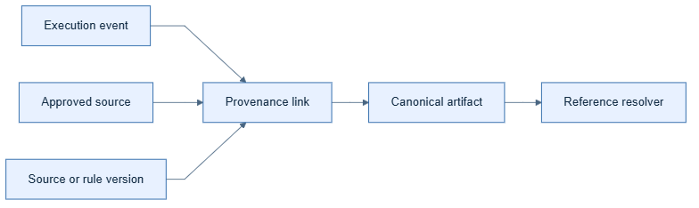

# Provenance architecture

## Kid-level view

Every card points back to the event or source that made it.

## Production view

The provenance layer carries run/node correlation, source identifiers,
versions, capture method, and resolution status. Stores and adapters preserve
links even when payloads are redacted.

## Why and example

An evidence record may point to a document ID and retrieval index version
while keeping sensitive text out of the canonical store.

## Common mistakes

Never manufacture source certainty, drop provenance during transformation, or
use timestamps as the only ordering key.
