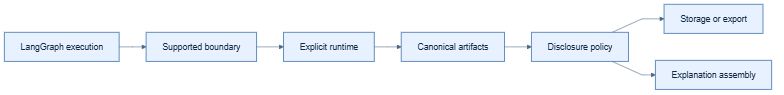

# Runtime

## Kid-level view

The runtime is the stage manager: it watches graph boundaries, collects
approved notes, and sends them to the right labeled boxes.

## Production view

`XAIRuntime` owns per-instance configuration, capture hooks, policy
evaluation, bounded concurrency, failure behavior, and adapter dispatch. It
does not own graph execution, authorization, or private model reasoning.

## Flow and example

`LangGraph boundary -> runtime event -> canonical artifact -> policy ->
storage/export -> explanation`. Construct one runtime explicitly and inject
providers; never depend on a process-global switch.

## Common mistakes

Do not put business truth only in runtime-generated prose, let adapters bypass
policy, or assume an observed boundary includes arbitrary nested state.
