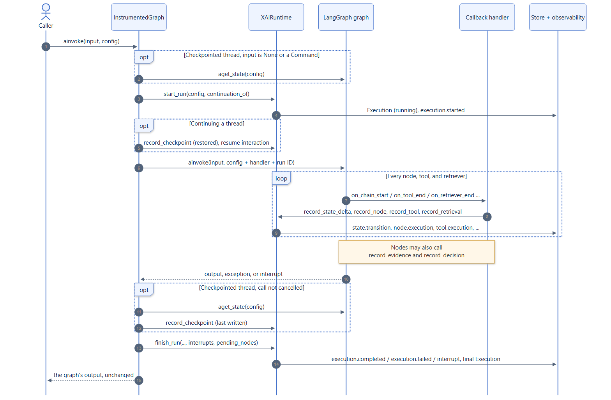

# Runtime

`XAIRuntime` turns observations into canonical records and delivers them to
providers. This page describes how a run flows through it, how runs follow your
code across tasks and threads, and how concurrency, timeouts, and failures are
handled.

## Runs

A `Run` is the in-memory handle on one execution. It holds the live `Execution`,
the semantic records (`run.evidence`, `run.decisions`), and a counter that
numbers the run's events.

- **`start_run(config, continuation_of=...)`** builds the `ExecutionContext`
  from the LangChain config, records a `running` `Execution`, and emits
  `execution.started`. `continuation_of` names the run this one continues.
- **`record_*` methods** create one canonical record each. Execution records
  (nodes, state changes, tools, retrievals, checkpoints, human interactions)
  are added to the `Execution` and emitted as events, unless the
  [capture policy](../concepts/policies.md#capture-policy) drops them. Semantic
  records (evidence, decisions, memory references) are kept on the run and
  delivered to plugins.
- **`finish_run(run, error, cancelled=..., interrupts=..., pending_nodes=...)`**
  sets the final status, records the exception, the interrupts, or the nodes a
  static breakpoint stopped before, emits the terminal event, and writes the
  final `Execution`.

A record added after a run has finished, such as an approval made outside the
graph, rewrites the stored `Execution`, so the store never falls behind the
in-memory run.

## Instrumented calls

`InstrumentedGraph` drives this lifecycle for every top-level call, as the
diagram shows:

1. For a graph with a checkpointer, a `thread_id`, and `capture_checkpoints`
   on, a call whose input is `None` or a `Command` continues the thread. The
   proxy reads the checkpoint it starts from, and the run that wrote it, from
   the checkpoint's metadata.
2. It starts the run, linked to that earlier run, and records the restored
   checkpoint and, for a resume, the answer.
3. It calls the wrapped graph with a callback handler for this run and the run
   ID in the config metadata, under `RUN_ID_METADATA_KEY`.
4. When the graph returns, raises, or pauses, it reads the thread's state again,
   unless the call was cancelled, to record the last checkpoint the run wrote
   and any pending interrupts or breakpoint nodes. Then it finishes the run.

Interrupts are collected from the `GraphInterrupt` LangGraph raises inside the
graph, and from the state read, and deduplicated by interrupt ID. This does not
depend on the output format, so every entry point, output version, and stream
mode is recorded the same way.

## Context propagation

The active run is stored in a context variable. That is why `xai.current_run`
works inside nodes, tools, and middleware without passing anything around:

- LangGraph and LangChain copy the context into the tasks and threads that run
  nodes, so the run follows the call into subgraphs, agents, and tools.
- For streaming calls, the run is bound only while the wrapped graph produces
  the next chunk. Your code between chunks runs outside it.
- A call made while an instrumented call of the same runtime is active joins
  that call's run instead of starting its own.
- `collect_runs()` uses a context variable too. It collects the runs started in
  its block and in tasks spawned from it, but not runs started concurrently
  elsewhere.

Different runtimes never see each other's runs: `current_run` returns a run
only to the runtime that started it.

## Synchronous code

The runtime is asynchronous. `xai.run_sync(coroutine)` runs a coroutine from
synchronous code. It is used by the instrumentation of `invoke`, `stream`, and
`batch`, and by synchronous nodes that record evidence.

- Each thread reuses one event loop, so recording from synchronous code does
  not create a new loop per call.
- The coroutine runs in a copy of the caller's context, so the current run and
  any active OpenTelemetry span carry over.
- When the calling thread already runs an event loop, as in a Jupyter notebook
  or a synchronous call made from async code, the coroutine runs on a
  background loop kept for that thread instead of deadlocking the busy loop.
  Later calls reuse it, and it stops when the thread releases it.

## Concurrency and timeouts

Every provider call (store write, event emit, capture-policy check, exposure
policy, attribution, explanation, plugin delivery) is one *operation*.

- At most `max_concurrency` operations run at once, across all threads and
  event loops of the runtime, including the per-thread loops of synchronous
  calls. Slots are granted first come, first served, and a waiting operation is
  woken on its own event loop as soon as a slot frees up.
- Work that cannot have an effect is skipped: events are not evaluated by the
  default capture policy, which allows everything, or sent to the default
  `NoOpObservability`, so neither takes a slot.
- Each operation has one budget of `operation_timeout_seconds`. Waiting for a
  slot and running the operation both count against it, so a saturated or slow
  backend surfaces as a `TimeoutError` instead of a stalled graph.
- Event sequence numbers are assigned under a per-run lock, so concurrent
  nodes, such as parallel branches, still produce a total order.

## Failure handling

An operation that raises or times out is handled once, centrally:

1. The error is appended to `xai.errors`, which keeps the last 100 errors.
2. In `FAIL_OPEN`, the operation is skipped and the graph continues.
3. In `FAIL_CLOSED` and `STRICT`, `XAIInstrumentationError` is raised, with the
   original error as `__cause__`. Callback handlers are registered so that
   LangChain re-raises it from the graph call instead of logging it.

Two rules take precedence over the failure mode:

- **The graph's own exception wins.** If the graph fails and recording that
  failure also fails, the graph's exception is raised and the recording error
  is logged.
- **Explanations fail closed.** `explain` and `explain_decision` raise in every
  mode when the policy, attribution, or engine fails.

Cancellation (`asyncio.CancelledError`, `KeyboardInterrupt`) is never
swallowed. The run is recorded as cancelled, and the cancellation propagates.

## Closing

`await xai.close()` flushes the observability provider and plugins, then closes
the store, the observability provider, and the plugins. Every step is attempted
even if an earlier one fails. In `FAIL_CLOSED` and `STRICT` the first failure is
raised afterwards. Closing is idempotent. A closed runtime refuses to start new
runs.
