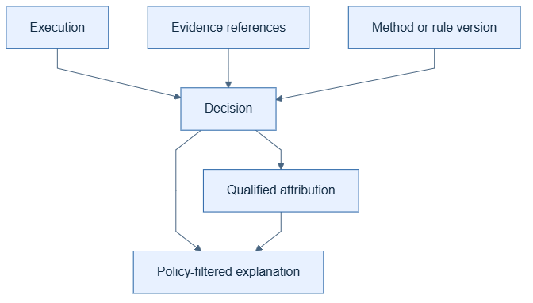

# Decisions

## Kid-level view

A decision says which option, branch, rule, or action was selected.

## Production view

A decision links to its execution and evidence, records the selected outcome,
decision method or rule version, alternatives when available, and uncertainty.
It describes an application event; it does not expose private chain-of-thought.

## Why and architecture

Separating decision records from prose lets evaluators inspect structured
behavior and lets renderers explain only approved fields.

## Real example: input and output

```python
decision = Decision(
    context=context,
    decision_type="routing",
    selected_action="HUMAN_REVIEW",
    candidate_actions=["AUTO_APPROVE", "HUMAN_REVIEW", "AUTO_DECLINE"],
    evidence_ids=[fraud_score_evidence.id, threshold_evidence.id],
    factors=[
        DecisionFactor(
            name="fraud_risk_score", value=0.91, weight=0.8, evidence_ids=[fraud_score_evidence.id]
        ),
        DecisionFactor(
            name="review_threshold", value=0.8, weight=0.2, evidence_ids=[threshold_evidence.id]
        ),
    ],
    confidence=0.91,
)
```

Real captured output, produced by
[`examples/canonical_model_gallery.py`](https://github.com/samamuniharish/langgraph-xai/blob/main/examples/canonical_model_gallery.py):

```json
{
  "schema_version": "1.0.0",
  "id": "31406623-8b6d-4148-8d54-e2ab93a8a39f",
  "decision_type": "routing",
  "selected_action": "HUMAN_REVIEW",
  "candidate_actions": ["AUTO_APPROVE", "HUMAN_REVIEW", "AUTO_DECLINE"],
  "evidence_ids": [
    "e42ff48a-9ecb-41e9-ba82-4a3d8cda4064",
    "1e74b6d9-dc1e-4be2-8d75-9b5395b680f3"
  ],
  "factors": [
    {
      "name": "fraud_risk_score", "value": 0.91, "weight": 0.8,
      "evidence_ids": ["e42ff48a-9ecb-41e9-ba82-4a3d8cda4064"]
    },
    {
      "name": "review_threshold", "value": 0.8, "weight": 0.2,
      "evidence_ids": ["1e74b6d9-dc1e-4be2-8d75-9b5395b680f3"]
    }
  ],
  "confidence": 0.91,
  "uncertainty": null
}
```

`route=HUMAN_REVIEW` here is exactly what an evaluator or auditor can inspect
without touching the graph's internal reasoning — the decision is a record
of *what was selected and against which evidence*, never a transcript of
*how a model arrived at it*.

## Mistakes to avoid

Record `route=manual_review`, `rule_version=2026-01`, and evidence references.
Do not infer a decision from a final answer alone or claim a causal mechanism
that was never recorded.



