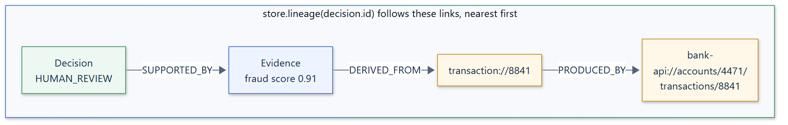

# Provenance

Provenance answers "where did this come from?". A `ProvenanceLink` connects an
upstream entity (the `source`) to something derived from it (the `target`).
Following links backwards from a decision leads to the original data it rests
on.

```python
await xai.record_provenance(
    "bank-api://accounts/4471/transactions/8841", "transaction://8841", "PRODUCED_BY"
)
await xai.record_provenance("transaction://8841", score.id, "DERIVED_FROM")
await xai.record_provenance(score.id, decision.id, "SUPPORTED_BY")
```



## Reading a link

A link is stored as `source_id`, `target_id`, and `relation`. The relation
describes the target in terms of its source: the transaction record was
`PRODUCED_BY` the bank API, the evidence was `DERIVED_FROM` the transaction,
and the decision was `SUPPORTED_BY` the evidence. This is the same direction
as W3C PROV's `wasDerivedFrom`.

IDs can be any string (a URI, a database key) or the UUID of a recorded
artifact. Relations are free-form strings. `PRODUCED_BY`, `DERIVED_FROM`, and
`SUPPORTED_BY` are conventions, not built-in keywords.

## Walking the graph

Links are written to the `ProvenanceStore` and queried with:

| Method | Returns |
| --- | --- |
| `store.parents(entity_id, context=...)` | Links whose target is the entity (one step upstream) |
| `store.children(entity_id, context=...)` | Links whose source is the entity (one step downstream) |
| `store.lineage(entity_id, context=..., max_depth=100)` | Every upstream link, breadth-first and nearest first. Each entity is visited once, so cycles end. |

All three require `context=`, an `ExecutionContext`. Queries are scoped to that
context's application, tenant, and run, so links from other tenants or runs are
never returned.

```python
store = xai.registry.require(ProvenanceStore)
lineage = await store.lineage(str(decision.id), context=run.execution.context)
```

Real output of that walk, from the
[canonical model gallery](https://github.com/smuniharish/langgraph-xai/blob/master/examples/canonical_model_gallery.py):

```json
{
  "source_id": "87507e0f-36f4-4a70-b81c-cf810ae222f3",
  "target_id": "d0744d50-0ef0-44fb-a44b-1535ad9a48b4",
  "relation": "SUPPORTED_BY"
}
{
  "source_id": "transaction://8841",
  "target_id": "87507e0f-36f4-4a70-b81c-cf810ae222f3",
  "relation": "DERIVED_FROM"
}
{
  "source_id": "bank-api://accounts/4471/transactions/8841",
  "target_id": "transaction://8841",
  "relation": "PRODUCED_BY"
}
```

## Guidance

- **Link at the boundary where data changes form**: an API response becomes a
  record, a record becomes a score, a score supports a decision. Links between
  every intermediate variable add noise without adding auditability.
- **Use stable, resolvable IDs** for external sources, such as URIs with a
  version or a database primary key, so an auditor can retrieve the original.
- **Provenance is not causation.** A link says the target was derived from the
  source. How much the source *influenced* a decision is the job of
  [attribution](attribution.md).
- Pass `provenance_ids` to `record_decision` when a decision should cite
  specific links.
