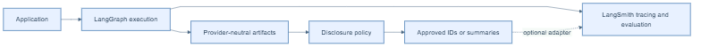

# LangSmith and langgraph-xai

**LangSmith and `langgraph-xai` are not competitors — they answer different
questions and are designed to run together.** This page exists because "is
this just another LangSmith?" is the most common first question about
xgraph, so it gets a direct, precise answer.

## The one-sentence version

> LangSmith tells you **what ran and how long it took**. `langgraph-xai`
> tells you **why the agent decided what it decided, what evidence backs
> that decision, and what you're allowed to disclose to which audience**.

## Precise boundary

LangSmith is an external tracing and evaluation platform; it owns its service
schemas, ingestion, evaluation workflows, and retention controls. The
explainability layer is a provider-neutral application-side model for
execution, provenance, evidence, decisions, attribution, and explanations. It
does not provide hosted tracing, replace LangGraph, or make LangSmith
unnecessary.

| Concern | LangSmith | langgraph-xai |
| --- | --- | --- |
| Tracing and operational inspection | Provides tracing-oriented capabilities. | Can associate artifacts with observed execution context. |
| Evaluation and experimentation | Provides evaluation-oriented capabilities. | Does not claim to replace those capabilities. |
| Explainability artifact model | May retain trace and application data selected by its configuration. | Targets structured provenance, evidence, decisions, attribution, and explanations. |
| Disclosure | Applies LangSmith configuration and controls. | Targets policy-aware filtering at capture, storage, export, and rendering boundaries. |
| Runs a real, non-trivial permutation test suite? | N/A (out of scope) | Yes — see the real [disclosure-policy matrix](../examples/disclosure-matrix.md): 16/16 real audience x policy x engine permutations, asserted, with a real LLM. |
| Requires a hosted backend? | Yes (SaaS or self-hosted) | No — ships with an in-process default; storage is a swappable `ProvenanceStore` (memory, PostgreSQL, ...). |

## Concretely, what would you lose by using only LangSmith?

LangSmith gives you a run tree with inputs/outputs and latencies per step.
What it does not give you, without you building it yourself, is:

- a queryable `Evidence` record distinct from a `ProvenanceLink` (see
  [ADR-004/005](../architecture/decisions.md));
- a `Decision` with named `factors`, ranked `AttributionContribution`s, and an
  explicit `evidence_ids` reference set;
- an `Explanation` that is deliberately different per audience, enforced by a
  swappable policy layer rather than by hand-filtering a trace in your UI
  code — see the real, asserted proof in the
  [disclosure-policy matrix](../examples/disclosure-matrix.md), where the
  *same* captured decision produces a full-detail explanation for
  `developer`/`auditor` and a withheld-attribution explanation for
  `business`/`end_user`;
- a hard guarantee that an LLM-generated explanation can never smuggle an
  extra, unvalidated field (`hidden_reasoning` and similar) past a strict
  Pydantic schema — see [ADR-013](../architecture/decisions.md).

## Complementary use

An application can use LangSmith for tracing and evaluation while using
`langgraph-xai` to model the approved evidence and decision basis needed for an
explanation. An adapter may export policy-approved context or identifiers that
help correlate systems — for example, the same `run_id`/`trace_id` that
xgraph attaches to every canonical artifact (proven with a real MCP tool
agent and a real `deepagents` run in
[MCP tools](../examples/mcp-tools.md) and [deepagents](../examples/deepagents.md))
can also be forwarded to LangSmith so both systems refer to the same run.

Neither product automatically makes the other unnecessary. The application
must decide what data is appropriate to send to each system and configure
credentials, retention, and access controls accordingly.

## Data and failure boundary

Only policy-approved IDs or summaries should cross an optional adapter. A
LangSmith outage is distinct from graph execution or local canonicalization;
the runtime's configured failure mode determines whether that integration
failure blocks the application (see [Failure handling](../architecture/failure.md)).
Credentials and LangSmith retention remain LangSmith/host configuration, not
canonical artifact fields.

## Avoiding misleading claims

Trace history alone is not necessarily an explanation, and a generated
explanation is not proof of causal reasoning. `langgraph-xai` does not record
private model chain-of-thought and does not position itself as a replacement
for LangSmith.

