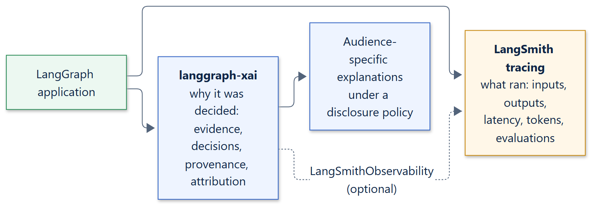

# LangSmith and langgraph-xai

LangSmith, Langfuse, and OpenTelemetry are **tracing** tools. `langgraph-xai`
is an **explainability** layer. They answer different questions, and they work
best together.

## Different questions

| | Tracing (LangSmith, Langfuse, OpenTelemetry) | langgraph-xai |
| --- | --- | --- |
| Question | What ran, how long did it take, what did it cost? | Why was this decided, on what evidence, and who may see the explanation? |
| Unit | Runs, spans, model calls, tokens | Evidence, decisions, provenance links, attributions, explanations |
| Source | Everything executed, captured automatically | Execution captured automatically, plus the decision basis recorded by your code |
| Audience | Engineers debugging and monitoring | Engineers, auditors, business owners, and end users, each with a policy |
| Disclosure | Project-level access control | Per-audience exposure policy applied to every explanation |
| Output | Trace views, dashboards, evaluations | `Explanation` objects you can show, store, or return through an API |
| Hosting | A service or collector | A library in your process, with pluggable storage |

## Different strengths

A trace shows that the `route` node ran after `score_risk`, that the model call
took 840 ms, and that the prompt had 1,200 tokens. It cannot tell an auditor
that the transaction went to human review *because* the fraud score of 0.91
exceeded policy FR-7's 0.80 threshold. Nor can it explain the same decision to
the customer without revealing the score.

`langgraph-xai` records that reasoning as data: the fraud score is evidence, the
threshold is a policy reference, and both are factors of a routing decision
with known alternatives. From those records it produces an auditor explanation
with attribution and evidence, and a customer explanation that withholds both
and says so. See the [fraud review example](../examples/full-explanation.md).

## Using them together

- **Keep your tracing.** LangChain's LangSmith tracing, Langfuse callbacks, and
  OpenTelemetry instrumentation keep working unchanged on an instrumented
  graph.
- **Forward explainability events** to the same backend with an adapter
  ([LangSmith](langsmith.md), [Langfuse](langfuse.md),
  [OpenTelemetry](opentelemetry.md)). Every event carries `xai.run_id`,
  `xai.trace_id`, and `xai.thread_id`, so both views of a call can be joined.
- **Pass a `trace_id`** in the call's metadata to tie the explainability record
  to the request ID your tracing already uses.

## When you need only one

- **Debugging latency, cost, or prompt quality?** Tracing is enough.
- **Explaining outcomes to reviewers or customers, proving what an action was
  based on, or controlling who sees which reasons?** That is what
  `langgraph-xai` is for. Tracing is optional.
