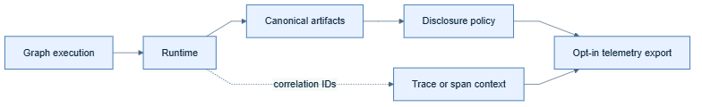

# OpenTelemetry

## Kid-level view

OpenTelemetry supplies shared labels for operations. It does not decide what
an explanation means.

## Production view

Use trace/span context for correlation and export only policy-approved IDs or
summaries through an opt-in adapter. Artifact schemas, evidence semantics,
redaction, and retention remain runtime/application responsibilities.



## Register the adapter

```python
from opentelemetry import trace
from opentelemetry.sdk.trace import TracerProvider
from opentelemetry.sdk.trace.export import BatchSpanProcessor, ConsoleSpanExporter

from langgraph_xai import XAIRuntime
from langgraph_xai.core.protocols import ObservabilityProvider
from langgraph_xai.observability import OpenTelemetryObservability

provider = TracerProvider()
provider.add_span_processor(BatchSpanProcessor(ConsoleSpanExporter()))
trace.set_tracer_provider(provider)

runtime = XAIRuntime(graph_id="fraud-review")
runtime.register(
    ObservabilityProvider,
    OpenTelemetryObservability(trace.get_tracer("fraud-review"), owns_provider=True),
)

graph = runtime.instrument(compiled_graph)
result = await graph.ainvoke({"transaction_id": "tx_9182"})

await runtime.close()  # force_flush + shutdown, since owns_provider=True
```

Requires the `opentelemetry` extra: `uv add "langgraph-xai[opentelemetry]"`.
Works with **any** configured exporter (console, OTLP, Jaeger, Zipkin, …) —
the adapter depends only on the standard `Tracer`/`Span` API, never on a
specific backend.

## What actually gets sent

Every canonical event becomes one OTel span (`event.event_type` as the span
name), with correlation fields (`run_id`, `trace_id`, `application_id`,
`tenant_id`) and the canonical JSON payload set as span attributes
(`xai.event_type`, `xai.payload`). Pass `owns_provider=True` only when
xgraph created the `TracerProvider` itself — otherwise `flush()`/`close()`
on the runtime leave your application's own provider lifecycle untouched.

## Common mistakes

Never treat a span as evidence, export raw payloads by default, or assume an
OTLP endpoint is an authorization boundary.
